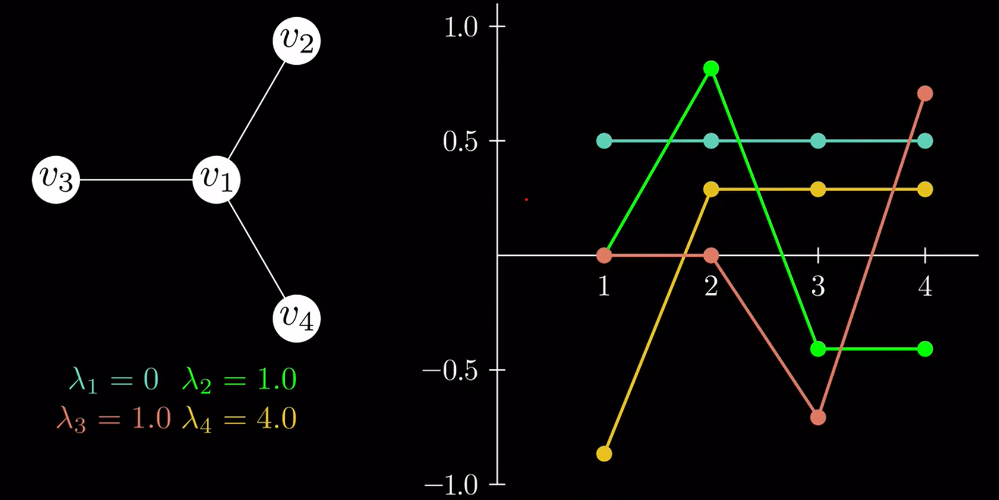

https://www.bilibili.com/video/BV1pr421L7xH
图可以用邻接矩阵表示, 邻接矩阵有特征值. 谱大概指一种在基空间上的分解. 
无向图的邻接矩阵是实对称阵, 令$D$为对角矩阵, 其对角元为相应顶点的度数, $A$是邻接矩阵, 则拉普拉斯矩阵$L=D-A$
图顶点个数为$n$, 记$f$为$n$维单位列向量, 可验证$(Lf)_i=\sum_{j\sim i} (f_i-f_j)$. 即$Lf_i$是$f_i$和$f_j$的差的总和, $j\sim i$表示$(i,j)\in E$. 令$Lf= \lambda f$,则$\lambda = f^T L f=\sum_if_iLf_i=\sum_if_i(\sum_{j\sim i} (f_i-f_j))=\sum_{i<j,i\sim j}(f(i)-f(j))^2$, 即对每个顶点和大于它邻接顶点(在f的作用下)做差的平方, 或者每个顶点和小于它的邻接顶点做差的平方. 
最后一个等式通过前一个等式展开后合并相邻项得到, 同时为了突出$f$是一个函数, 将下标写成了变量. 从而我们得到
> 1.$L$是半正定的.  
> 2.$0$总是一个特征值(取$f$为常值)  
> 3.$\lambda$越小, $f$越平缓; 如果$f$为两个图的$L$的特征向量, 则$\lambda$越小, 图的连接度越小.  

下面是星形图的谱图, 右图为特征向量各个分量的值. 为什么对应于4.0的特征向量看上去反而没有2.0对应的特征向量平滑?因为方差关心的是每对顶点的差, 但$\lambda$关心的是连通的那些顶点的差, 所以1和其他顶点的差会更有份量, 从这个角度看, 特征值4对应的特征向量仍然是最不平滑的.

下面是有三个连通分量的图, 有趣的是,第$i$个0的特征向量只有在第$i$个连通分量的点上是非0的. 比如青色的线只在1,2,3上非0,而这正好是第一个连通分量包含的点. 推广一下, 完全没有边的图特征值只有0, 而其特征向量确实是$e_i$.

为什么叫拉普拉斯矩阵?拉普拉斯算子是$\nabla^2 f=\nabla \cdot \nabla f=\sum_i \frac{\partial^2 f}{\partial x_i^2}$.大致说来, 它量化了点和其邻域的平均值的大小关系(?).

猜想:有多少个连通分量,特征值0的重数就有多少?正确的.

如何从其他的特征值中提取出图的信息?
假设我们的特征值从小到大排序, Fielder eigenvector指导第二小且不为0的特征值 $\lambda_2>0$, 考虑到$L$是实对称阵, 不同特征值的特征向量相互正交. 而0对应的特征向量为常值, 所以$\sum_i f_2(i)=0$. 而$f_2$在很多情况下, 能找到被一条边连起来的两个clique(由$f_2$的正值和负值分别对应). 有时会不生效(比如两个集团被同一个点连起来, 画一个沙漏), 这样中间点在$f_2$中对应0(因为它不知道自己应该离那个clique更近!), 这时可以通过给边加上权重解决(度数就是权重和, 而邻接矩阵中的边也被权重代替).
这自然引出了后面的内容, 其它特征值对应的特征向量如何呢?也就是说

$$f_k=\underset{f}{\mathrm{argmin}} f^TLf,\quad s.t \quad f_k^Tf_{j}=0(j<k),f_k^Tf_k=1.$$

这就像主成分分析(PCA)了,不过考虑同心圆似地排布的数据集, 它们有中心对称性, 很难降维, 但继承上面思想的谱聚类(spectral clustering)就可以做了. (详见论文 On spectral clustering, Analysis and an algorithm)
